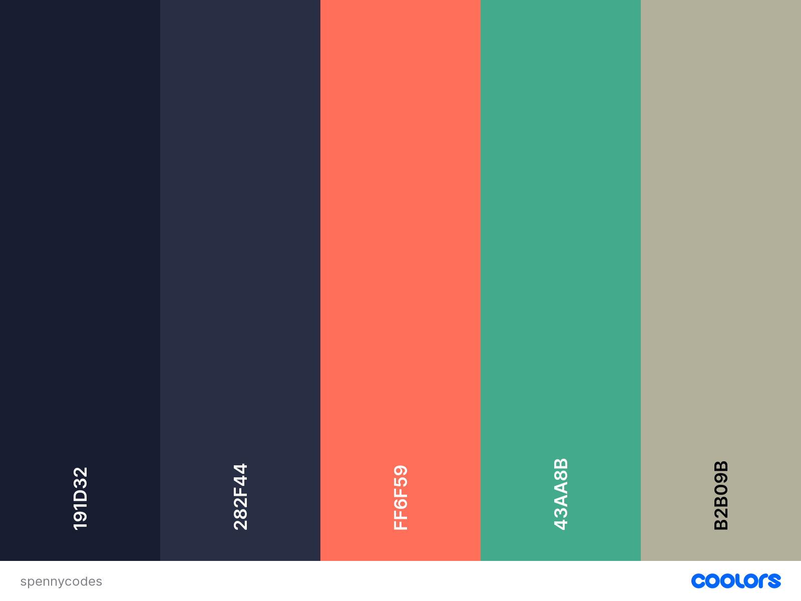
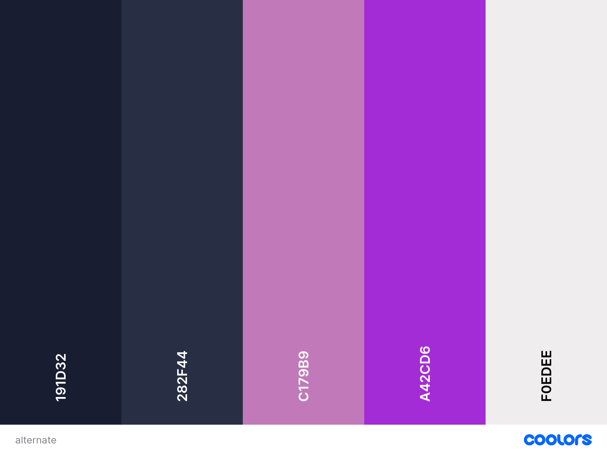

# Font and Color Palletes for Personal Site

## Colors
Color pallete generated using [Coolors](https://coolors.com) until I found one I like

Using this pallete, the two darker colors will be used as background/backdrop, the very bright colors will be for text/accents

This is an alternative pallete which may also be used! I like the white with dark background and purple for accents, but unsure if it's overplayed or not. We'll see which works best!

## Fonts
Canva's pairings I quite like, we'll have to see which fits the best, but they can be found [here](https://www.canva.com/learn/the-ultimate-guide-to-font-pairing/)
